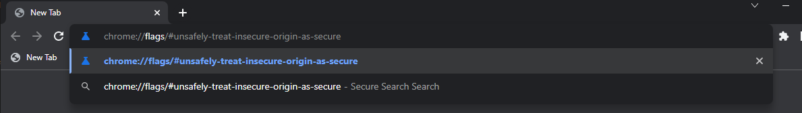
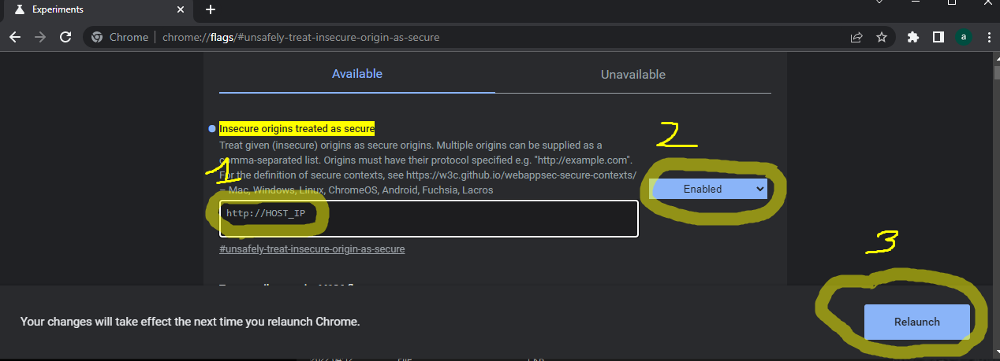

# access non secure urls
- For this, we need chrome install.
- the the search bar, go to chrome://flags/#unsafely-treat-insecure-origin-as-secure
```
chrome://flags/#unsafely-treat-insecure-origin-as-secure
```


- then inside the `insecure origins treated as secure add the url to treat as secure, enable it and reload the chrome which you should be notified at the bottom of the page



Go to the url and access anything